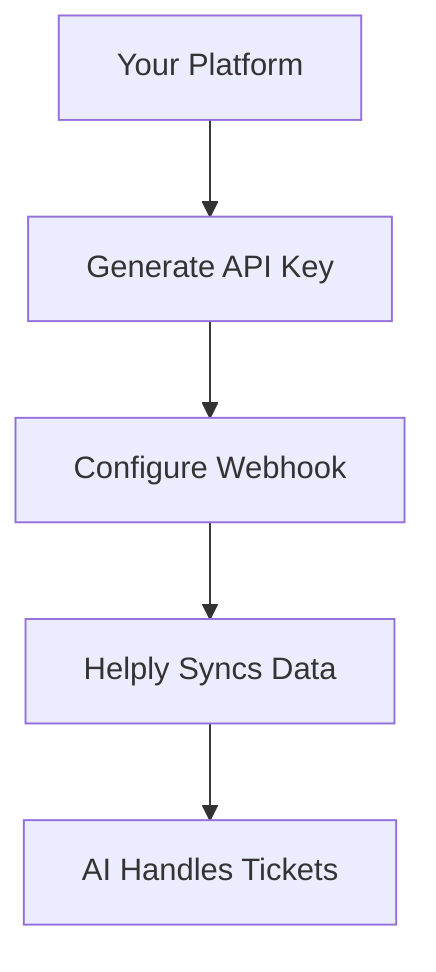

## Overview

Helply integrates seamlessly with leading support platforms and third-party services. You enable AI-powered ticket resolution by connecting your tools, allowing Helply to access tickets, respond automatically, and learn from interactions. Start by selecting your platform below and follow the dedicated guides.

<Columns cols={3}>
  <Card title="Zendesk" icon="help-circle" href="#zendesk">
    Connect to your Zendesk instance for automated ticket handling.
  </Card>
  <Card title="Intercom" icon="message-circle" href="#intercom">
    Sync conversations and enable multilingual AI responses.
  </Card>
  <Card title="Slack" icon="hash" href="#slack">
    Receive notifications and trigger actions in your workspace.
  </Card>
</Columns>

<Callout kind="tip">
  Ensure you have admin access to your platform and generate an `{API_KEY}` from your Helply dashboard before starting.
</Callout>

## Integration Flow



## Integrating with Zendesk

Follow these steps to connect Helply to Zendesk.

<Steps>
  <Step title="Create Helply App in Zendesk" icon="settings">
    Log in to Zendesk Admin Center. Navigate to **Apps and integrations** > **Zendesk Support apps** > **Add custom app**. Paste the Helply OAuth details from your dashboard.
  </Step>
  <Step title="Set Up Webhook" icon="link">
    In Helply dashboard, go to **Integrations** > **Zendesk**. Enter your subdomain and `{API_TOKEN}`.
  </Step>
  <Step title="Test Connection" icon="zap">
    Create a test ticket in Zendesk. Verify Helply processes it within `<60s`.
  </Step>
</Steps>

<Tabs>
  <Tab title="JavaScript SDK" icon="code">
    ```javascript
    import { Helply } from '@helply/sdk';

    const client = new Helply({ subdomain: 'yourcompany', apiToken: 'your_token' });
    const tickets = await client.zendesk.tickets.list();
    console.log(tickets);
    ```
  </Tab>
  <Tab title="Python SDK" icon="python">
    ```python
    from helply import Helply

    client = Helply(subdomain="yourcompany", api_token="your_token")
    tickets = client.zendesk.tickets.list()
    print(tickets)
    ```
  </Tab>
</Tabs>

## API and Webhook Configuration

Use Helply's REST API for custom integrations. Authenticate with `Bearer {API_KEY}`.

<Request tabs="cURL,JavaScript">
  ```bash
  curl -X POST https://api.helply.ai/v1/webhooks \
    -H "Authorization: Bearer your_api_key" \
    -H "Content-Type: application/json" \
    -d '{
      "url": "https://yourapp.com/webhook",
      "events": ["ticket.created", "ticket.updated"]
    }'
  ```
  ```javascript
  const response = await fetch('https://api.helply.ai/v1/webhooks', {
    method: 'POST',
    headers: {
      'Authorization': 'Bearer your_api_key',
      'Content-Type': 'application/json'
    },
    body: JSON.stringify({
      url: 'https://yourapp.com/webhook',
      events: ['ticket.created', 'ticket.updated']
    })
  });
  ```
</Request>

<Response tabs="201,400">
```json
{
  "id": "wh_123abc",
  "url": "https://yourapp.com/webhook",
  "events": ["ticket.created", "ticket.updated"],
  "active": true
}
```

```json
{
  "error": "Invalid URL format"
}
```
</Response>

<ParamField path="subdomain" param-type="string" required="true">
  Your Zendesk subdomain, e.g., `acme`.
</ParamField>

<ParamField header="Authorization" param-type="string" required="true">
  Bearer token from Helply dashboard.
</ParamField>

## Troubleshooting Common Issues

<ExpandableGroup>
  <Expandable title="Webhook not triggering" default-open="true">
    Check your firewall allows inbound requests from `*.helply.ai`. Verify the `{EVENT_PAYLOAD}` matches expected schema.
  </Expandable>
  <Expandable title="Sync delays >5min">
    Increase your plan's concurrency limit in Helply settings. Monitor queue status via dashboard.
  </Expandable>
  <Expandable title="Auth failures">
    Regenerate `{API_KEY}` and update all integrations. Ensure no extra spaces in tokens.
  </Expandable>
</ExpandableGroup>

<Callout kind="alert">
  If issues persist, contact support@helply.ai with your integration logs.
</Callout>