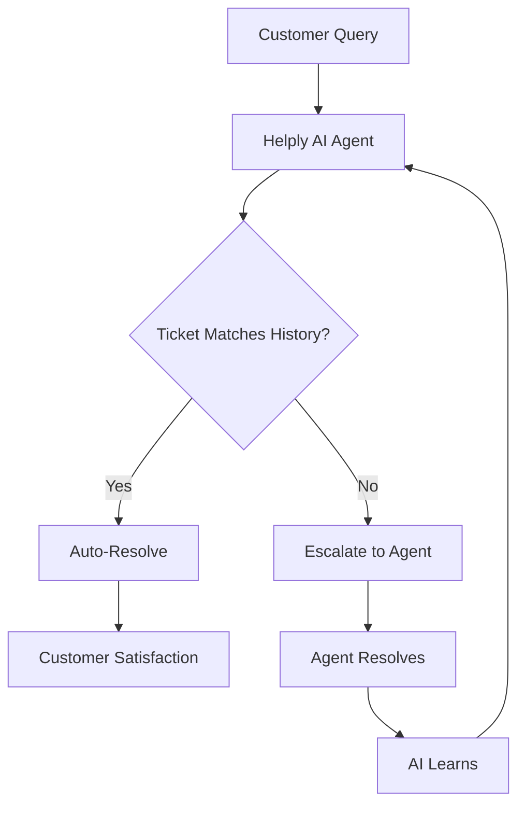

## Overview

Helply empowers service leaders to scale high-quality support using an AI agent that learns from your past tickets. This intelligent system improves response speed and accuracy across all languages, providing 24/7 coverage without hiring more agents. You gain a reliable partner that adapts to your unique support patterns.

<Columns cols={3}>
  <Card title="AI-Powered Agent" icon="bot" href="/docs/agent">
    Your AI agent handles inquiries autonomously, escalating complex issues to humans when needed.
  </Card>
  <Card title="Multilingual Support" icon="globe" href="/docs/languages">
    Supports 50+ languages out of the box, trained on your ticket history for cultural nuance.
  </Card>
  <Card title="Ticket Learning" icon="brain" href="/docs/learning">
    Continuously improves by analyzing resolved tickets, reducing repeat issues over time.
  </Card>
</Columns>

## Key Benefits for Service Teams

Helply delivers measurable results for your team. Reduce resolution times by up to 40% while maintaining quality. Key advantages include:

<Tabs>
  <Tab title="Speed" icon="zap">
    Automate routine queries to free agents for high-value work. Achieve `<3s` first response times.
  </Tab>
  <Tab title="Accuracy" icon="check-circle">
    Leverages your data for precise answers, minimizing errors and escalations.
  </Tab>
  <Tab title="Scalability" icon="trending-up">
    Handles volume spikes without proportional cost increases, scaling effortlessly.
  </Tab>
</Tabs>

<Callout kind="success">
  Teams using Helply report 30% fewer tickets through proactive resolution powered by learned patterns.
</Callout>

## How Helply Transforms Support Operations

Helply integrates seamlessly into your workflow, transforming reactive support into proactive efficiency.



This flow ensures every interaction contributes to continuous improvement.

## Get Started Quickly

Follow these steps to deploy Helply in minutes.

<Steps>
  <Step title="Sign Up" icon="user-plus">
    Create your account at [helply.ai](https://helply.ai) and connect your ticket system.
  </Step>
  <Step title="Integrate" icon="plug">
    Add the Helply widget to your site or app.
  </Step>
  <Step title="Train & Launch" icon="rocket">
    Helply analyzes your tickets automatically. Go live once trained.
  </Step>
</Steps>

<CodeGroup tabs="JavaScript,React">
```javascript
// Embed Helply chat widget
window.helply.init({
  apiKey: 'your-api-key',
  target: '#chat-container'
});
```

```jsx
// React integration
import { HelplyProvider } from '@helply/react';

function App() {
  return (
    <HelplyProvider apiKey="your-api-key">
      <YourApp />
    </HelplyProvider>
  );
}
```
</CodeGroup>

## Resources and Support

<ExpandableGroup>
  <Expandable title="API Documentation" default-open="true">
    Explore full API reference for custom integrations.
  </Expandable>
  <Expandable title="Community Forum">
    Join discussions and share best practices.
  </Expandable>
  <Expandable title="Contact Support">
    Reach our team for personalized assistance.
  </Expandable>
</ExpandableGroup>

<Callout kind="info">
  Need help? Email `support@helply.ai` or use the in-app chat for instant assistance.
</Callout>